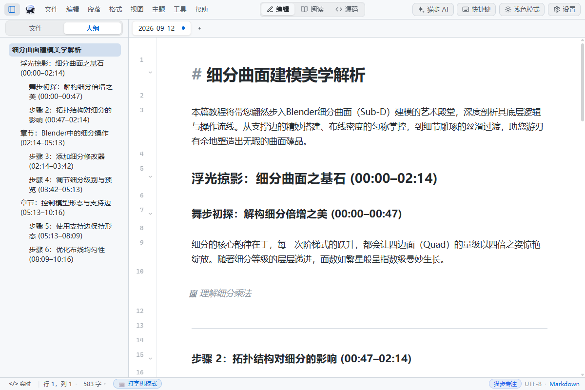
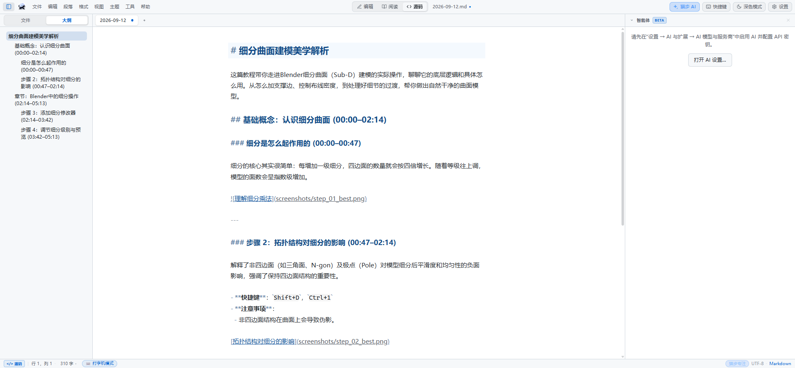
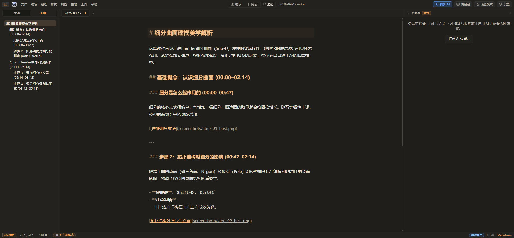

# 猫步 MD (Catstep MD)

> Ciche kroki, płynne myśli. Lekki edytor Markdown w stylu Typora, w którym mieszkają agenci.

[](https://github.com/maobukeai/catstep-md/releases)
[](LICENSE)
[](https://github.com/maobukeai/catstep-md)
[](https://github.com/maobukeai/catstep-md)

🌐 **[中文](README.zh.md) · [日本語](README.ja.md) · [한국어](README.ko.md) · [Deutsch](README.de.md) · [Français](README.fr.md) · [Español](README.es.md) · [Português](README.pt.md) · [Italiano](README.it.md) · [Polski](README.pl.md) · [Nederlands](README.nl.md) · [Türkçe](README.tr.md) · [Svenska](README.sv.md) · [Українська](README.uk.md)** · 🪞 **[Gitee mirror →](https://gitee.com/maobukeai/catstep-md)**

[**Download Releases**](https://github.com/maobukeai/catstep-md/releases) · [**Roadmap**](docs/roadmap.md) · [**Privacy & Security**](#privacy--security)

---

## 📸 Real Screenshots

### 🌟 Real WYSIWYG Live Preview & Smooth-Scrolling Outline Navigator


### 🎨 Theme-Adaptive Subdued Source Mode & Immersive Eye-Care Dark Mode
<p align="center">
  
  
</p>

---

## 🍃 What is Catstep MD?

Your notes should simply be transparent Markdown files in a local folder.

**Catstep MD** is a desktop Markdown knowledge editor crafted for pure, distraction-free writing. It harmoniously combines **Typora-grade immersive typography and minimalist aesthetics**, a **modern local-first AutoGit time machine**, and a **first-class built-in AI Agent assistant with native MCP endpoint capabilities**.

Engineered on **Tauri 2 + Vue 3 + CodeMirror 6**, Catstep MD weighs only ~15–30 MB, launches in milliseconds, and uses less than a quarter of the memory consumed by typical Electron alternatives. 100% free and open-source (MIT), with no cloud account lock-in. Your prose, version history, API credentials, and local vectors remain strictly on your machine.

---

## ✨ Key Features

### 1. ✍️ Typora-Grade Pure Writing Experience
- **WYSIWYG Live Preview**: Seamless typing and formatting integration. Markdown tokens appear on cursor focus and render instantly as you move away;
- **Subdued Theme-Adaptive Source Mode (`Ctrl+/`)**: Headings, markers, links, code, and active line glow adapt gracefully to your active theme's accent color without visual glare;
- **Smooth-Scrolling Outline Navigator**: Heading navigation features natural physics-damped smooth scrolling to locate exact positions in long documents;
- **In-Place Interactive Markdown Tables**: Navigate cells effortlessly with `Tab` / `Shift+Tab`; hitting Enter in the last cell automatically extends a new row;
- **Immersive Reading View**: Clean distraction-free reading; double-click any paragraph to return instantly to live editing;
- **Rich Theme Ecosystem**: Ships with Light, Dark, Amber, Nord, Catppuccin, Dracula, and Warm themes with full custom CSS token flexibility.

### 2. 🤖 Built-in Catstep AI Assistant & MCP Protocol Endpoint
- **First-Class AI Agent Panel**: Streamed multi-turn conversations with your notes, inline tool call inspection, and context awareness;
- **Smart Polish & One-Click Insertion**: Polish, expand, or summarize selected text; insert AI responses directly at the cursor or replace current selections;
- **14+ Direct LLM Providers (BYOK)**: Connect directly to OpenAI, Claude, Gemini, DeepSeek, Qwen, GLM, Kimi, Doubao, SiliconFlow, and local Ollama. API keys are safely stored in your operating system's native keychain;
- **Built-in MCP Server**: Exposes standard MCP tools so Claude Code, Cursor, Windsurf, or custom AI agents can query and manipulate your local vault from outside.

### 3. 🛡️ Local-First & AutoGit Time Machine
- **Plain Text Freedom**: Standard `.md` files residing in your filesystem. Zero proprietary formats, zero database lock-in;
- **Millisecond AutoGit Time Machine**: Automatic lightweight local git commits on save. Inspect per-note commit history, view visual line diffs, and revert changes with a single click;
- **Bidirectional Links & Knowledge Graph**: Link your ideas with `[[wikilink]]`, inspect backlinks, and explore connected concepts visually via the Neighborhood Graph.

---

## 📊 Feature Comparison

| Feature | Catstep MD | Obsidian | Typora |
| :--- | :---: | :---: | :---: |
| **License** | **MIT (100% Free & Open Source)** | Proprietary (Free personal) | Paid Commercial ($14.99) |
| **Architecture** | **Tauri 2 (Rust + Native WebView)** | Electron | Electron |
| **Installer Size** | **~15–30 MB (Ultra Lightweight)** | ~120 MB | ~95 MB |
| **Memory & Startup** | **Instant launch, minimal memory footprint** | Slower startup, high memory | Medium startup & memory |
| **WYSIWYG Live Preview** | ✅ **Pure Typora-style typography** | ✅ Live Preview | ✅ Classic WYSIWYG |
| **Theme-Adaptive Source Mode** | ✅ **Subdued semantic hierarchy** | ❌ Plain text highlighting | ✅ Fixed magenta palette |
| **Smooth Outline Navigation** | ✅ **Damped smooth scrolling** | ❌ Instant jump | ✅ Smooth scrolling |
| **Interactive Tables** | ✅ **Tab / Enter auto-expand** | 🟡 Requires complex setup | ✅ Native table editor |
| **Built-in AI Assistant (BYOK)** | ✅ **14+ providers + one-click insert** | 🟡 Third-party plugins | ❌ No built-in AI |
| **Version Time Machine (AutoGit)** | ✅ **Automatic local commits + diff** | 🟡 Requires Git plugin | ❌ Basic file history |
| **Built-in MCP Endpoint** | ✅ **Ready out of the box** | ❌ No official support | ❌ None |
| **Data Privacy** | ✅ **Zero cloud dependency, OS keychain** | 🟡 Paid sync cloud | ✅ Local files |

---

## 🚀 Download & Installation

Grab the latest release from GitHub Releases: [**Catstep MD Releases**](https://github.com/maobukeai/catstep-md/releases)

- **Windows (x64 / ARM64)**: Fast `.msi` installers and standalone `.zip` portable versions;
- **macOS (Apple Silicon & Intel Universal)**: Standard `.dmg` installer packages;
- **Linux (x86_64 / aarch64)**: `.AppImage`, `.deb`, and `.rpm` packages.

---

## 🔒 Privacy & Security

1. **Strictly Local**: All your Markdown notes reside exclusively on your local storage. No content is ever sent to private cloud servers;
2. **Hardware Credential Isolation**: API keys are saved directly into your operating system's native credential vault (Windows Credential Manager, macOS Keychain, Linux Secret Service);
3. **Direct Vendor Requests**: AI network calls connect point-to-point from your machine directly to the provider endpoints without intermediate proxies;
4. **Transparent & Auditable**: 100% open-source under the MIT license for full community review.

---

## 🛠️ Building from Source

Prerequisites: Rust (stable), Node 18+, pnpm.

```bash
# Clone repository
git clone https://github.com/maobukeai/catstep-md.git
cd catstep-md/app

# Install dependencies
pnpm install

# Start development with hot reload
pnpm tauri dev

# Build release bundle
pnpm tauri build
```

---

## 🤝 Community & Contributions

Contributions, bug reports, and feature ideas are warmly welcome:
- **Report an issue:** [GitHub Issues](https://github.com/maobukeai/catstep-md/issues)
- **Join discussions:** [GitHub Discussions](https://github.com/maobukeai/catstep-md/discussions)
- **Explore our roadmap:** [docs/roadmap.md](docs/roadmap.md)

---

## 📄 License & Acknowledgments

This project is open-sourced under the [MIT License](LICENSE).

Special thanks to Tauri 2, Vue 3, CodeMirror 6, markdown-it, KaTeX, Mermaid, libgit2, and all contributors across the open-source ecosystem.
