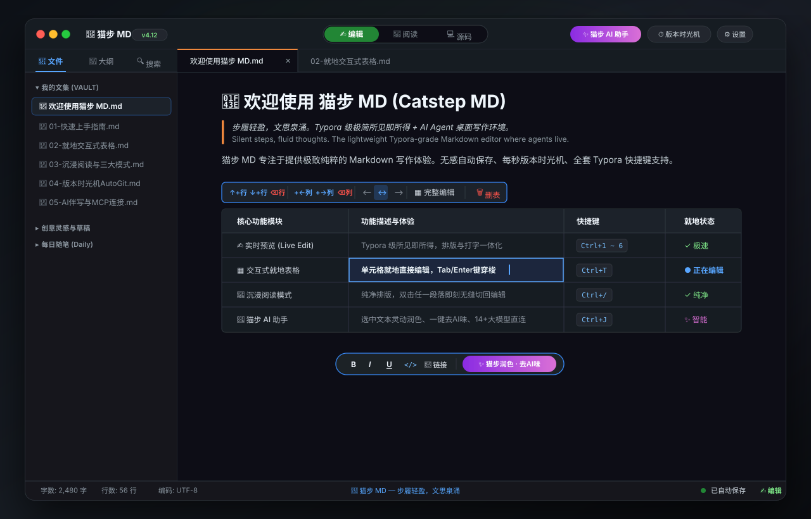

# 猫步 MD (Catstep MD)

> 步履轻盈，文思泉涌。让 Agent 住进来的 Typora 风格轻量 Markdown 编辑器。

[](https://github.com/maobukeai/catstep-md/releases)
[](LICENSE)
[](https://github.com/maobukeai/catstep-md)
[](https://github.com/maobukeai/catstep-md)

🌐 **[English](README.md) · [日本語](README.ja.md) · [한국어](README.ko.md) · [Deutsch](README.de.md) · [Français](README.fr.md) · [Español](README.es.md) · [Português](README.pt.md) · [Italiano](README.it.md) · [Polski](README.pl.md) · [Nederlands](README.nl.md) · [Türkçe](README.tr.md) · [Svenska](README.sv.md) · [Українська](README.uk.md)**

[**下载最新正式版 (Releases)**](https://github.com/maobukeai/catstep-md/releases) · [**Gitee 镜像**](https://gitee.com/maobukeai/catstep-md) · [**功能路线图**](docs/roadmap.md) · [**安全与隐私**](#隐私与安全)



你的笔记是一个文件夹。**猫步 MD (Catstep MD) 既是极致纯粹的 Typora 风格所见即所得编辑器、内置一等公民的 AI Agent 助手与版本时光机，也是 Claude Code / Cursor 直接能从外部驱动的 MCP 端点。** 同样的 `.md` 文件。在编辑器里专注写作，也可随时跟你的知识库对话；同一个知识库还能无缝交给任何 MCP 客户端。

基于 Tauri 2 + Vue 3 + CodeMirror 6 构建。极速轻巧，内存占用极低。免费 / 开源 MIT / 无强制订阅 / 无私有云端。笔记、AI Key、向量索引、AutoGit 本地版本历史，全部安全留在你自己的电脑上。

## 同一份产品的三半

**编辑器。** WYSIWYG 实时编辑（Typora 风格）、标签 + 分屏、KaTeX + Mermaid 数学公式、图片粘贴到 `_assets/`、演讲模式（`⌘⌥P`）、Vim 模式、Hunspell + 中文校对、语义搜索（`⌘⇧F`）、wikilink + 反链、Pandoc 导出。CJK 编码（GBK / Big5 / Shift-JIS）自动识别。

**端点。** 自带 `solomd-mcp` 二进制,把同一个 vault 暴露给任意 MCP 客户端 —— 开箱 13 个工具,其中 5 个 SoloMD 独有(`autogit_log`、`autogit_diff`、`autogit_rollback`、`sync_status`、`share_url`),别家 markdown MCP 服务都没有。v4.0 加了 `--workspace path1 --workspace path2` federation —— 一个 MCP 会话,多个 vault。再加一个 `solomd agent <prompt>` 命令行,把任务直接交给 Claude Code / Codex CLI,MCP 已预先连好。

**Agent 面板（v4.0）。** 右侧一等公民 Agent 面板：流式 chat-with-vault、`[[wikilink]]` 引用解析为真笔记跳转、工具调用卡片在对话流里展开、**插入** / **复制** 按钮把回复塞回当前编辑器。同时支持声明式 **Recipe** —— YAML 文件放在 `<workspace>/.solomd/agents/*.yml`,触发器 `cron` / `on-save` / `on-commit` / `on-tag-add` / 手动。**每次 Agent 写入都落到独立 AutoGit 分支上,你点 Accept 才合入 `main`**;单次 write-cap 默认 5;工作区脏时拒绝启动;每次运行生成可重放的 `trace.jsonl`,新增 `read_agent_trace` MCP 工具暴露给其他 agent。

| 功能 | |
|---|---|
| **Agent 面板** *(v4.0)* | 流式 chat-with-vault,跟大纲 / 反向链接 / 标签 / 历史平级。工具调用卡片在对话流里展开;回复"插入" / "复制"到当前编辑器;运行历史以 markdown 形式存在 `.solomd/agent-runs/`。 |
| **定时 Recipe** *(v4.0)* | YAML 文件放在 vault 里。AutoGit 分支沙箱 + accept/reject UI 评审后再合 main。单次 write-cap(默认 5,硬上限 50)。自带 11 个起步模板。 |
| **可重放 Trace** *(v4.0)* | 按步 `trace.jsonl`(`prompt` / `model_call` / `tool_call` / `tool_result` / `git_commit`)。"从第 N 步重放"按钮回退后重新跑。 |
| **多 vault MCP Federation** *(v4.0)* | `solomd-mcp --workspace path1 --workspace path2`。一个 Claude Desktop 会话,多个 vault。设置 → 集成里有 MCP profile UI。 |
| **Ollama 一等公民** *(v4.0)* | 自动检测 `localhost:11434`。三个模型预设(`qwen2.5:1.5b/7b/14b`)。Recipe 用 `provider: local` 跑零云成本自动循环。 |
| **AI 改写,BYOK** | 14 个服务 —— OpenAI · Claude · Gemini · DeepSeek · 通义千问 · 智谱 GLM · Kimi · 豆包 · 硅基流动 · OpenRouter · Mistral · Groq · xAI · Ollama。Key 存在系统钥匙串里,直连厂商,不经我们手。 |
| **GitHub 同步** | 每次保存推到自己的 GitHub 私库,定时拉取。可选端到端加密(Argon2id + XChaCha20-Poly1305)。GitLab / Gitea / 任意 HTTPS git 地址也支持。 |
| **每篇笔记 AutoGit** | 每次 `⌘S` 在工作区里的本地 `.git` 写一次提交。libgit2 内嵌,不需要装系统 git。永不自动 push。 |
| **内置 MCP server** | `solomd-mcp` 跟随安装包发出,13 个工具(8 通用 + 5 SoloMD-only)。stdio 协议,不开网络端口。默认只读,`--allow-write` 显式开启写入。 |
| **本地 REST API** *(v4.0)* | 只监听 localhost,token 鉴权。和 MCP 同一套接口,给那些还没接 MCP 的客户端用 —— Alfred / Raycast / n8n / 你自己的脚本。 |
| **BYOK 成本计** *(v4.0)* | 按 provider 累计 token 数,opt-in。设置 → 集成。 |
| **云盘联动** | 工作区在 `~/Library/Mobile Documents/...` 或 `~/Dropbox/...` 里时,SoloMD 自动识别,并在此之上加一层跨设备会话恢复 —— 文件级同步交给系统。 |
| **公开只读分享** | 命令面板 → 复制 GitHub 文件链接。在浏览器里就能直接查看你公库里这篇笔记。 |

## 怎么用

macOS / Linux 装好 SoloMD 后:

**1. 跟你的 vault 对话。** 打开右侧 Agent 面板(⌘⇧P → "View: Toggle Agent Panel" 如果隐藏了)。流式多轮 chat,工具调用卡片实时显示每次读写。回复太长?**插入**按钮把回复塞到当前笔记的光标处(有选区就替换);**复制**进剪贴板。

**2. 定时跑 Recipe。** 设置 → Recipes → 浏览菜谱。11 个起步模板:周报、日报、TODO 抽取、翻译过一遍、引用清理、CJK 校对 agent、链接腐烂检测、front-matter 规范化、大纲转博客、重构过一遍、周度 tag 整理。安装、改 prompt、运行。

**3. 从外部 LLM 客户端驱动同一个 vault。** 一键打印 MCP 配置:

```bash
solomd mcp-config
```

```json
{
  "mcpServers": {
    "solomd": {
      "command": "/Applications/SoloMD.app/Contents/Resources/solomd-mcp",
      "args": ["--workspace", "/Users/me/Documents/SoloMD"]
    }
  }
}
```

粘到 Claude Desktop / Cursor / 等。多 vault federation 重复 `--workspace`:

```json
"args": [
  "--workspace", "/Users/me/Documents/SoloMD",
  "--workspace", "/Users/me/Documents/work-notes"
]
```

**4. 或者一句话直接交给 claude / codex CLI:**

```bash
solomd agent "把这周的 daily 整理成 weekly review，提交并推送"
```

路径穿越保护已加。不开网络端口。LLM 只能看到你指给它的工作区。

## 安装与下载

最新正式版本可在 GitHub Releases 下载：[**Catstep MD Releases**](https://github.com/maobukeai/catstep-md/releases)。

**系统要求:** Windows 10+、macOS 10.15+、主流 Linux 发行版。

### 桌面版安装

- **Windows (x64)**: 前往 [Releases 发布页](https://github.com/maobukeai/catstep-md/releases) 下载 `.msi` 安装包或绿色便携免安装版。
- **macOS (Universal / Apple Silicon & Intel)**: 前往 [Releases 发布页](https://github.com/maobukeai/catstep-md/releases) 下载 `.dmg` 镜像安装包。
- **Linux (x86_64 / aarch64)**: 提供 `.AppImage`、`.deb`、`.rpm` 格式安装包。

## 横向对比

| | SoloMD v4.5 | Obsidian | Typora | Tolaria |
|---|---|---|---|---|
| 协议 | **MIT** | 私有协议(免费) | 付费($14.99) | AGPL |
| 技术栈 | Tauri 2(Rust + WebView) | Electron | Electron | Tauri 2 |
| 平台 | macOS · Win · Linux · **iPad/iOS/安卓** | macOS · Win · Linux · iOS · Android | macOS · Win · Linux | macOS · Win · Linux |
| 安装包 | ~32 MB(Mac)/ ~10 MB(Win) | ~120 MB | ~95 MB | ~25 MB |
| **内置 Agent 面板** | **✅ v4.0** | 🟡 付费插件(Smart Composer / Copilot) | ❌ | 🟡 provider+agent,无内嵌面板 |
| **定时 Agent Recipe** | **✅ v4.0** | ❌ | ❌ | ❌ |
| **AutoGit 分支沙箱 + accept/reject** | **✅ v4.0** | ❌ | ❌ | ❌ |
| **可重放 Agent Trace** | **✅ v4.0** | ❌ | ❌ | ❌ |
| **多工作区** | **✅ v4.0 MCP Federation** | ❌ | ❌ | 🟡 多 vault |
| **MCP server** | **✅ 内置 13 工具,5 个独家** | ❌(社区插件) | ❌ | ✅ 通用 |
| **AI 改写内建** | **✅ 14 个 BYOK 服务** | 仅插件 | ❌ | ✅ 内置 provider |
| GitHub 同步 | ✅ | ❌(Obsidian Sync $5/月) | ❌ | ❌ |
| 端到端加密 | ✅ 在你自己的库里 | ✅ 在 Obsidian 服务器上 | ❌ | ❌ |
| 本地语义搜索 | ✅ 默认关 | 仅插件 | ❌ | ❌ |
| 每篇笔记版本历史 | ✅ AutoGit | 仅插件 | ❌ | ✅ |
| Markdown 白板(tldraw) | ❌ | 🟡 Canvas(私有格式) | ❌ | ✅ |
| CJK 编码(GBK / Big5) | ✅ 自动识别 | ❌ | ❌ | ❌ |

详细对比:[vs Obsidian](https://solomd.app/zh/compare/vs-obsidian) · [vs Typora](https://solomd.app/zh/compare/vs-typora) · [vs Tolaria](https://solomd.app/zh/compare/vs-tolaria) · [vs Marktext](https://solomd.app/zh/compare/vs-marktext)。

## 隐私与安全

纯客户端。你的 `.md` 文件留在你选的文件夹里。API key 存在系统钥匙串(macOS Keychain / Windows Credential Manager / Linux libsecret),**永远不进 localStorage 或配置文件**。AI 请求从你的机器直连厂商 —— 不经 SoloMD 中转。RAG 嵌入索引和 AutoGit 仓库都是本地。MCP server 走 stdio,不开网络端口。整个代码库 MIT 协议,可审计。

**Agent 安全护栏(v4.0)。** 每次 Recipe 运行都开自己的 AutoGit 分支 —— `main` 在你点 Accept 之前一动不动。单次 write-cap(默认 5,硬上限 50)防止失控循环。Recipe runner 在工作区脏时直接拒绝启动(agent commit 不会扫到你的 WIP)。所有接受用户传入路径的 Tauri / MCP / REST 端点都前置拒绝 `..` 段和绝对路径。

E2EE 同步用 Argon2id(RFC9106 默认参数)→ XChaCha20-Poly1305,确定性 nonce + path-as-AAD。明文留在你的设备上;远端只看到密文。`sync.json` 解析失败会**拒绝推送**,绝不降级到明文(v3.0.x 审计修过的一条)。

完整说明:<https://solomd.app/zh/security>。

## 从源码编译

依赖:Rust(stable)、Node 18+、pnpm。

```bash
git clone https://github.com/maobukeai/catstep-md.git
cd catstep-md/app
pnpm install
pnpm tauri dev      # 热重载开发
pnpm tauri build    # 打 release 包 → src-tauri/target/release/bundle/
```

Linux 还需要 `libdbus-1-dev` 用于钥匙串后端。

MCP server 是独立 crate,在 `mcp-server/` 目录;端到端测试用的 dev MCP harness 在 `dev-mcp/`。端到端测试入口:`scripts/v4-self-test.sh`(用 `--with-release --with-ollama --with-ui` 跑全量)。

## 贡献

欢迎提交 Issue 与 Pull Request —— [前往 GitHub Issues](https://github.com/maobukeai/catstep-md/issues)。开发路线参考 [`docs/roadmap.md`](docs/roadmap.md)。

## 社区与交流

- **GitHub Discussions:** [参与讨论与交流](https://github.com/maobukeai/catstep-md/discussions)
- **Issues 反馈:** [提交 Bug 或需求建议](https://github.com/maobukeai/catstep-md/issues)

## 开源协议与致谢

[MIT](LICENSE) © 2026 maobukeai。猫步 MD (Catstep MD) 站在 Tauri 2、Vue 3、CodeMirror 6、markdown-it、KaTeX、Mermaid、libgit2、Pandoc、Hunspell、`keyring-rs` 和 `rmcp` 的肩膀上。开源仓库：[GitHub (maobukeai/catstep-md)](https://github.com/maobukeai/catstep-md)。