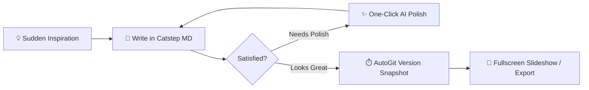

# Live Edit Mode — Typora-Grade Immersive Writing ✍️

> 💡 **Three-State View Switcher**: Press **`Ctrl+/`** (or click the segmented mode pill centered in the top toolbar) to effortlessly switch between **✍️ Edit (Live Preview) ⇄ 📖 Reader (Zen Mode) ⇄ 💻 Source (Raw Markdown)**. In Live Edit mode, Markdown tags render inline as you type, and raw markers automatically expand whenever your cursor rests on a line.

---

## 1. Headings & Structural Hierarchy

Press `Ctrl+1` through `Ctrl+6` to instantly set heading levels, or press `Ctrl+0` to return to regular body text:

# Heading 1 (H1) — High-Level Outline
## Heading 2 (H2) — Core Chapter
### Heading 3 (H3) — Key Arguments
#### Heading 4 (H4) — Detailed Points
##### Heading 5 (H5)
###### Heading 6 (H6)

---

## 2. Inline Formatting & Selection Bubble Bar

Select any text and the **Selection Bubble Bar** will smoothly float into view, offering one-click styling and Catstep AI polishing:

- **Bold text** (`Ctrl+B`)
- *Italic text* (`Ctrl+I`)
- ***Bold and italic combined***
- <u>Underline styling</u> (`Ctrl+U`)
- ~~Strikethrough~~ (`Ctrl+Shift+X` or `Alt+Shift+5`)
- `Inline code` (`Ctrl+Shift+` `)
- ==Highlight accent==
- Hyperlinks: [Catstep MD GitHub Repository](https://github.com/maobukeai/catstep-md) (`Ctrl+K`)

---

## 3. In-Place Interactive Tables

Press **`Ctrl+T`** to insert a table. Move your cursor into the table below to experience the **in-place floating table toolbar**:

| Shortcut Action | Trigger Key | Result |
| :--- | :---: | :--- |
| **Next Cell** | `Tab` | Moves right smoothly; press Tab on the last cell to auto-add a new row |
| **Previous Cell** | `Shift+Tab` | Moves left smoothly |
| **Insert / Delete Rows & Columns** | Floating Toolbar | Click [Row Above/Below], [Col Left/Right], or [Delete] |
| **Column Alignment** | Floating Toolbar | Align Left, Center, or Right with a single click |

---

## 4. Standalone Math Blocks (KaTeX)

Press **`Ctrl+Shift+M`** to insert a math block. Catstep MD renders math formulas with live, in-place preview and editing:

$$
f(x) = \int_{-\infty}^{\infty} \hat{f}(\xi)\,e^{2 \pi i \xi x}\,d\xi
$$

Inline formulas are equally seamless: mass-energy equivalence $E = mc^2$, or Euler's identity $e^{i\pi} + 1 = 0$.

---

## 5. Code Blocks & Syntax Highlighting

Press **`Ctrl+Shift+K`** to insert a fenced code block with full syntax highlighting across dozens of languages:

```typescript
// Catstep MD: Minimalist on the surface, powerhouse underneath
interface NoteDocument {
  id: string;
  title: string;
  mode: 'liveEdit' | 'read' | 'source';
  autoGitEnabled: boolean;
}

function createCatstepNote(title: string): NoteDocument {
  return {
    id: crypto.randomUUID(),
    title,
    mode: 'liveEdit',
    autoGitEnabled: true,
  };
}
```

```python
# Python syntax is natively highlighted as well
def fibonacci(n: int) -> list[int]:
    sequence = [0, 1]
    while len(sequence) < n:
        sequence.append(sequence[-1] + sequence[-2])
    return sequence
```

---

## 6. Task Lists & Nested Items

- [x] Full Typora keyboard shortcut parity
- [x] In-place table floating toolbar and fluid Tab navigation
- [x] Top three-state switcher and Zen Reader mode
- [x] Selection bubble bar with instant actions
- [ ] Enjoy peaceful, frictionless writing

---

## 7. Flowcharts & Diagrams (Mermaid)



---

## 8. Smart Cursor Reveal Experience

Place your cursor on any styled line (such as the headings, bold text, or link above) — the raw Markdown delimiters appear instantly for precise editing. Move your cursor away, and the tags melt away into clean, beautiful typography.
