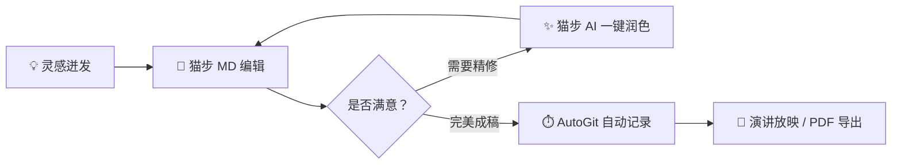

# 实时编辑模式 — Typora 级沉浸书写体验 ✍️

> 💡 **三态模式切换**：按 **`Ctrl+/`**（或点击顶栏居中的模式胶囊）可在 **✍️ 编辑（实时预览）⇄ 📖 阅读（沉浸阅读）⇄ 💻 源码（纯文本）** 之间自由切换。在实时编辑模式下，Markdown 标记随着打字即时呈现为排版效果，光标停留行自动展开源码。

---

## 一、 标题与排版层级

按 `Ctrl+1` 到 `Ctrl+6` 可秒级设定标题层级，按 `Ctrl+0` 瞬间恢复普通正文：

# 一级标题 (H1) — 宏观大纲
## 二级标题 (H2) — 核心篇章
### 三级标题 (H3) — 论述要点
#### 四级标题 (H4) — 细节展开
##### 五级标题 (H5)
###### 六级标题 (H6)

---

## 二、 行内强调与悬浮灵动条

选中文本时，上方会自动出现 **悬浮灵动条 (Selection Bubble Bar)**，支持一键格式化与 AI 润色：

- **加粗文本** (`Ctrl+B`)
- *斜体文本* (`Ctrl+I`)
- ***粗斜体结合***
- <u>下划线标记</u> (`Ctrl+U`)
- ~~删除线样式~~ (`Ctrl+Shift+X` 或 `Alt+Shift+5`)
- `行内代码` (`Ctrl+Shift+` `)
- ==高亮重点==
- 超链接支持：[猫步 MD 开源仓库](https://github.com/maobukeai/catstep-md) (`Ctrl+K`)

---

## 三、 就地交互式表格 (In-Place Table)

按 **`Ctrl+T`** 插入表格。将光标移动到下方表格内，即可体验 **就地表格悬浮工具条**：

| 快捷动作 | 触发按键 | 体验效果 |
| :--- | :---: | :--- |
| **切换下一个单元格** | `Tab` | 顺畅右移，末行末格按 Tab 自动增行 |
| **切换上一个单元格** | `Shift+Tab` | 顺畅左移 |
| **插入 / 删除行列** | 悬浮工具条 | 点击上方悬浮条的 [插入行] [插入列] [删除] |
| **列对齐方式** | 悬浮工具条 | 一键设置 左对齐、居中对齐 或 右对齐 |

---

## 四、 独立数学公式块 (KaTeX)

按 **`Ctrl+Shift+M`** 插入公式块。猫步 MD 支持实时公式渲染与就地编辑：

$$
f(x) = \int_{-\infty}^{\infty} \hat{f}(\xi)\,e^{2 \pi i \xi x}\,d\xi
$$

行内公式同样优雅：质能方程 $E = mc^2$，欧拉恒等式 $e^{i\pi} + 1 = 0$。

---

## 五、 代码块与语法高亮

按 **`Ctrl+Shift+K`** 插入代码块，支持几十种主流语言语法着色：

```typescript
// 猫步 MD：极简外观下蕴含全能动力
interface NoteDocument {
  id: string;
  title: string;
  mode: 'liveEdit' | 'read' | 'source';
  autoGitEnabled: boolean;
}

function createCatstepNote(title: string): NoteDocument {
  return {
    id: crypto.randomUUID(),
    title,
    mode: 'liveEdit',
    autoGitEnabled: true,
  };
}
```

```python
# Python 同样原生高亮
def fibonacci(n: int) -> list[int]:
    sequence = [0, 1]
    while len(sequence) < n:
        sequence.append(sequence[-1] + sequence[-2])
    return sequence
```

---

## 六、 任务清单与多级列表

- [x] 深度兼容 Typora 经典快捷键体系
- [x] 就地表格悬浮操作与 Tab 顺畅导航
- [x] 顶部三态切换器与沉浸阅读模式
- [x] 选中文本自动浮现灵动操作条
- [ ] 享受宁静高效的书写时光

---

## 七、 流程图与图表 (Mermaid)



---

## 八、 光标智能展开体验

把光标移动到任意行内（例如上面的标题、加粗或超链接）—— 原始 Markdown 标记会即时显现供你精准修改；移开光标后，标记即刻平滑隐藏，始终为你保留最纯粹的美观视野。
