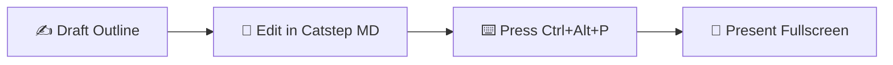

# Slideshow Mode — Elegant & Distraction-Free Fullscreen Presentations 🚀

Catstep MD turns any Markdown document into a **fullscreen presentation** in seconds — say goodbye to clunky presentation software, with zero export steps or external dependencies.

---

## 1. How to Start the Presentation

- **Keyboard Shortcut**: Press **`Ctrl+Alt+P`** (or `Cmd+Alt+P` on macOS) — the active document instantly opens in a fullscreen presentation window.
- **Command Palette**: Press **`Ctrl+Shift+P`** to open the Command Palette, type **"Present Slideshow"**, and press Enter.

---

## 2. How Slides Are Split

Simply use a line containing only three hyphens **`---`** between paragraphs as a slide break:

```markdown
# Slide 1: The Spark of Inspiration

Minimalist and lightweight. Make writing a true pleasure.

---

# Slide 2: Core Architecture

- Tauri 2 + Rust native high-performance engine
- Deep Typora keybinding compatibility
- Live edit, in-place tables, and Catstep AI

---

# Slide 3: Shipped to Perfection

Silent steps. Fluid thoughts. Just write.
```

> 💡 **Smart Detection**: YAML Front Matter at the top of the document (`--- ... ---`) is automatically parsed and skipped — it will never create an unwanted blank slide.

---

## 3. Slide Navigation & Controls

| Key | Action |
| :--- | :--- |
| `→` / `↓` / `Space` / `PageDown` | Next slide |
| `←` / `↑` / `PageUp` | Previous slide |
| `Home` / `End` | First / last slide |
| `F` | Toggle fullscreen / windowed presentation |
| `?` | Show presentation shortcuts helper card |
| `Esc` | Exit presentation and return to editor |
| Left Click | Next slide |
| Vim keys | `h` `j` `k` `l` navigation supported |

---

## 4. Rich Content Rendering Support

The presentation engine inherits Catstep MD's complete rendering stack: syntax-highlighted code blocks, KaTeX math formulas, in-place tables, alert callouts, task checklists, and Mermaid diagrams all render natively!



---

## 5. Presentation & Layout Tips

- **Concise Headings**: A single `# Heading` paired with 2 to 4 concise bullet points delivers the cleanest look on large projection screens.
- **Auto-Scaling Typography**: The slide engine dynamically scales font sizes to match your screen and projector resolution.
- **Code Snippets**: Highlight core logic per slide. For larger blocks, break them across consecutive slides for readability.
- **Dual-Monitor Setup**: Present fullscreen on your main projector while keeping the Catstep MD editor open on your laptop screen as speaker notes.

---

## 6. Try It Now

That's all there is to it! Try it right on this document — press **`Ctrl+Alt+P`** (or `Cmd+Alt+P` on macOS) right now to begin your first presentation!
