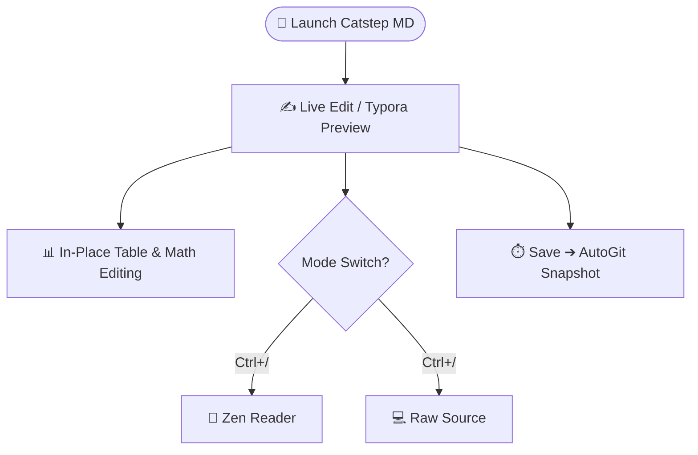

# Markdown Syntax Guide — Catstep MD Comprehensive Cheat Sheet 📝

> 💡 **What You See Is What You Get**: Press **`Ctrl+/`** to seamlessly switch between **✍️ Edit (Live Preview) ⇄ 📖 Reader (Zen Mode) ⇄ 💻 Source (Raw Markdown)**. Catstep MD is fully compatible with CommonMark, GFM (GitHub Flavored Markdown), and core Typora extensions.

---

## 1. Headings Hierarchy

Press `Ctrl+1` through `Ctrl+6` to quickly set heading levels, or press `Ctrl+0` to reset to regular body text:

# Heading 1 (H1)
## Heading 2 (H2)
### Heading 3 (H3)
#### Heading 4 (H4)
##### Heading 5 (H5)
###### Heading 6 (H6)

---

## 2. Inline Emphasis & Styles

- **Bold** (`Ctrl+B`) and *Italic* (`Ctrl+I`)
- ***Bold and italic combined***
- <u>Underline styling</u> (`Ctrl+U`)
- ~~Strikethrough~~ (`Ctrl+Shift+X` or `Alt+Shift+5`)
- ==Highlight mark==
- `Inline code` (`Ctrl+Shift+` `)
- Hyperlink: [Catstep MD Repository](https://github.com/maobukeai/catstep-md) (`Ctrl+K`)
- Footnote support[^1] (auto-numbered when moving away)

[^1]: Footnotes are grouped at the bottom with bidirectional backlink navigation.

---

## 3. GitHub / Typora Style Alert Callouts

Catstep MD natively renders 5 structured alert callouts:

> [!NOTE]
> **Note**: Background context, implementation details, or helpful explanations.

> [!TIP]
> **Tip**: Performance optimizations, best practices, or efficiency suggestions.

> [!IMPORTANT]
> **Important**: Essential requirements, critical steps, or must-know information.

> [!WARNING]
> **Warning**: Breaking changes, compatibility issues, or potential gotchas.

> [!CAUTION]
> **Caution**: High-risk actions that could cause data loss or security vulnerabilities.

---

## 4. Lists & Task Checklists

### 1. Unordered Lists & Nesting
- Core philosophy: Minimalist, focused, lightweight
  - Powered by Tauri 2 + Rust for native high performance
  - Vue 3 + CodeMirror 6 for instant responsiveness
- Respecting muscle memory with complete Typora keybindings

### 2. Ordered Lists
1. Open your notes folder or a single Markdown file
2. Enjoy distraction-free, inline live editing
3. Press `Ctrl+S` to save or let AutoGit track history

### 3. Task Checklists
- [x] Align Typora shortcuts and typography themes
- [x] Support in-place table floating toolbar and Tab navigation
- [x] Integrate Catstep AI assistant and AutoGit time-machine
- [ ] Embark on today's focused writing and creative journey

---

## 5. Fenced Code Blocks & Syntax Highlighting

Press **`Ctrl+Shift+K`** to insert a code block with support for dozens of languages:

```rust
// Catstep MD: High-performance Rust foundation
fn main() {
    println!("Hello, Catstep MD! Blazingly fast, silent steps.");
}
```

```json
{
  "name": "catstep-md",
  "version": "1.0.0",
  "theme": "newsprint",
  "features": ["liveEdit", "inPlaceTable", "autoGit", "catstepAI"]
}
```

---

## 6. In-Place Interactive Tables

Press **`Ctrl+T`** to insert a table. Placing your cursor inside a table brings up the **floating table toolbar** to add/remove rows and columns and set alignment:

| Feature | Live Edit Mode | Raw Source Mode | Slideshow Mode |
| :--- | :---: | :---: | :---: |
| **Typora Live Preview** | ✅ Native Inline | Plain Text | Fullscreen Slide |
| **In-Place Floating Toolbar** | ✅ Interactive Bar | Markdown Source | Slide Formatting |
| **Tab / Shift+Tab Navigation** | ✅ Smooth Fluid Flow | Indentation | — |
| **Math Formula In-Place Preview** | ✅ Live Render | LaTeX Source | Math Typeset |

---

## 7. Math Formulas (KaTeX)

Press **`Ctrl+Shift+M`** to insert a display math block:

$$
\int_{-\infty}^{\infty} e^{-x^2}\, dx = \sqrt{\pi}
$$

Inline formulas are also supported within sentences, such as Euler's formula: $e^{i\pi} + 1 = 0$.

---

## 8. Diagrams & Flowcharts (Mermaid)



---

## 9. YAML Front Matter & Asset Folder

```yaml
---
title: Catstep MD Syntax Guide
author: Catstep Team
imageRoot: ./images
---
```

> 💡 **imageRoot Helper**: When images are pasted or dragged into the editor, they are automatically saved into the subfolder specified by `imageRoot`.

---

## 10. Horizontal Rules & Fullscreen Slideshow

Three hyphens `---` draw a horizontal divider in normal writing.

In **Fullscreen Slideshow Mode** (press **`Ctrl+Alt+P`**), they automatically function as **slide breaks**, allowing you to give presentations without any external slide software!
