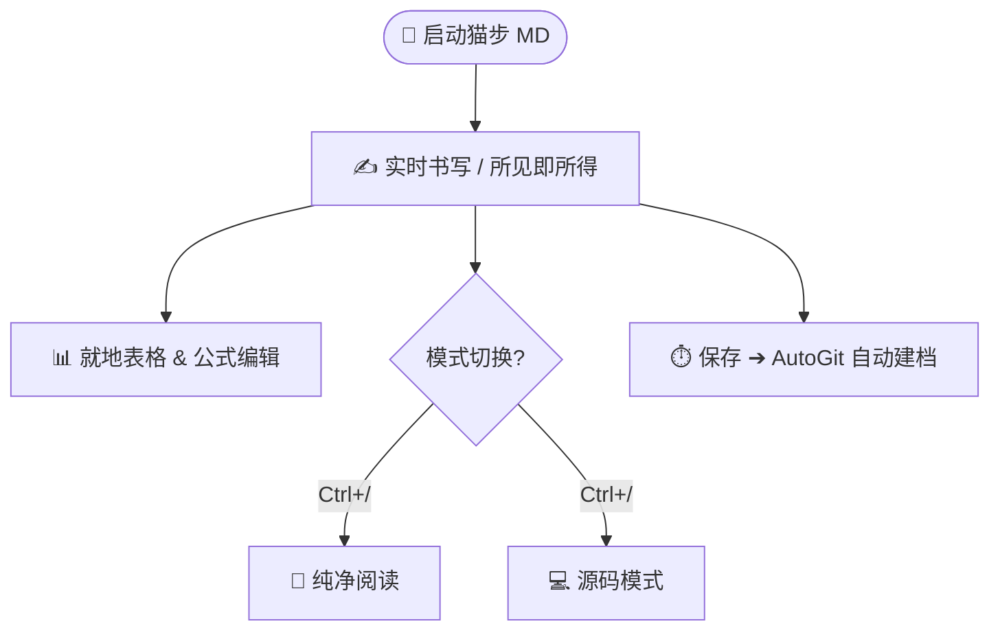

# Markdown 语法指南 — 猫步 MD 全能排版速查 📝

> 💡 **排版即所见**：按 **`Ctrl+/`** 在 **✍️ 编辑（实时预览）⇄ 📖 阅读（沉浸阅览）⇄ 💻 源码（纯文本）** 之间自由切换。猫步 MD 全面兼容 CommonMark、GFM (GitHub Flavored Markdown) 规范及 Typora 核心体验扩展。

---

## 一、 标题体系 (Headings)

按 `Ctrl+1` 到 `Ctrl+6` 快速设置标题级别，按 `Ctrl+0` 还原为普通正文段落：

# 一级标题 (H1)
## 二级标题 (H2)
### 三级标题 (H3)
#### 四级标题 (H4)
##### 五级标题 (H5)
###### 六级标题 (H6)

---

## 二、 文本强调与行内样式 (Inline Styles)

- **粗体** (`Ctrl+B`) 与 *斜体* (`Ctrl+I`)
- ***粗斜体结合***
- <u>下划线标记</u> (`Ctrl+U`)
- ~~删除线样式~~ (`Ctrl+Shift+X` 或 `Alt+Shift+5`)
- ==高亮重点标记==
- `行内代码` (`Ctrl+Shift+` `)
- 超链接：[猫步 MD 开源仓库](https://github.com/maobukeai/catstep-md) (`Ctrl+K`)
- 脚注支持[^1]（光标移开后自动编号）

[^1]: 脚注内容会统合在文末呈现，支持双向跳转引用。

---

## 三、 警告与呼出提示块 (Alert Callouts)

猫步 MD 原生支持 GitHub / Typora 风格的 5 种结构化警示提示块：

> [!NOTE]
> **说明**：提供背景说明、附加信息或延展阅读内容。

> [!TIP]
> **技巧**：书写过程中的捷径建议与效率最佳实践。

> [!IMPORTANT]
> **重点**：用户必须了解或达成的关键操作准则。

> [!WARNING]
> **警告**：需要特别留意、防范可能出现偏差的警示信息。

> [!CAUTION]
> **警惕**：涉及数据变动、重要覆盖等高风险动作的防范提示。

---

## 四、 列表与任务清单 (Lists & Tasks)

### 1. 无序列表与嵌套
- 核心理念：极简、专注、轻量
  - 采用 Tauri 2 + Rust 本地高效底座
  - Vue 3 + CodeMirror 6 极速响应
- 尊重用户习惯，全键位对齐 Typora

### 2. 有序列表
1. 打开笔记库或单篇 Markdown 文档
2. 享受零打扰、所见即所得书写流
3. 按 `Ctrl+S` 即时保存或 AutoGit 自动记录

### 3. 任务清单
- [x] 完成 Typora 快捷键对齐与主题适配
- [x] 支持就地表格悬浮工具条与 Tab 导航
- [x] 接入猫步 AI 润色与 AutoGit 时光机
- [ ] 开启今日愉悦的书写与创作旅程

---

## 五、 代码块与语法高亮 (Code Blocks)

按 **`Ctrl+Shift+K`** 快速插入独立代码块，支持几十种编程语言：

```rust
// 猫步 MD：Rust 本地高性能架构
fn main() {
    println!("Hello, Catstep MD! 极速启动，步步轻盈。");
}
```

```json
{
  "name": "catstep-md",
  "version": "1.0.0",
  "theme": "newsprint",
  "features": ["liveEdit", "inPlaceTable", "autoGit", "catstepAI"]
}
```

---

## 六、 就地交互式表格 (In-Place Tables)

按 **`Ctrl+T`** 插入表格。光标停留在表格内部时，上方会浮现 **悬浮工具条**，可一键增删行、列并实时调整对齐：

| 功能特性 | 实时编辑模式 | 源码模式 | 演讲模式 |
| :--- | :---: | :---: | :---: |
| **Typora 级所见即所得** | ✅ 原生支持 | 纯文本展示 | 演示放映 |
| **就地表格悬浮工具条** | ✅ 交互浮条 | Markdown 源码 | 幻灯片排版 |
| **Tab / Shift+Tab 导航** | ✅ 极速流转 | 缩进处理 | — |
| **公式就地编辑预览** | ✅ 即时呈现 | LaTeX 源码 | 数学排版 |

---

## 七、 数学公式 (KaTeX)

按 **`Ctrl+Shift+M`** 插入独立公式块：

$$
\int_{-\infty}^{\infty} e^{-x^2}\, dx = \sqrt{\pi}
$$

也支持在正文中随手书写行内公式，例如著名的欧拉公式：$e^{i\pi} + 1 = 0$。

---

## 八、 架构图与流程图 (Mermaid)



---

## 九、 YAML Front Matter 与资源目录

```yaml
---
title: 猫步 MD 语法指南
author: Catstep Team
imageRoot: ./images
---
```

> 💡 **imageRoot 贴心功能**：将本地图片拖拽或粘贴进编辑器时，图片会自动规范存储在 `imageRoot` 定义的子目录中。

---

## 十、 分隔线与全屏幻灯片 (Slideshow)

三个连续连字符 `---` 在普通排版中呈现为水平分割线。

而在 **全屏演讲模式**（按 **`Ctrl+Alt+P`**）下，它会自动作为 **幻灯片分页符**，无需借助 PPT 即可直接开始专业演示！
